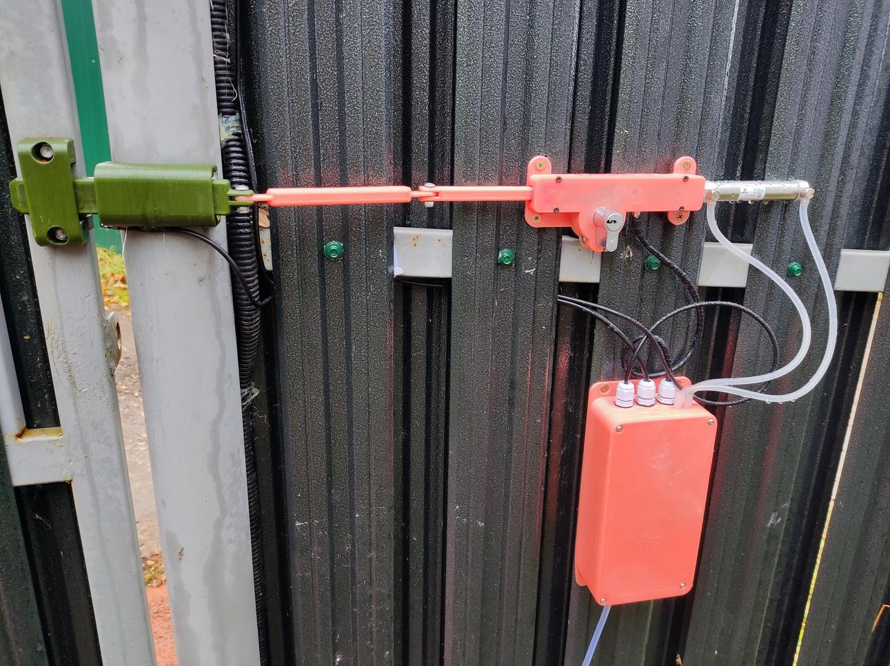

# smart-door-lock

ESP32-S2 based smart lock designed for my "unique" yard entrance door, which can open to both directions.
I'm unable to find any existing smart lock, that can operate with such way, and which has mechanical key for the case of blackout.

Features:
1. Have input to signal open from video doorbell panel (ext input), with disable switch
2. Have button to unlock the door from internal side (int input), with disable switch
3. Have "latch mode", when device will automatically lock the door once it reaches closed position, with disable switch
4. Have door position sensor (open/close)

## Gen 2 (pneumatic version)

Based on S2 mini, D1Motor shield, tiny 12V compressor (like in blood pressure gauges), pressure sensor,
solenoid valves and pneumatic cylinder.

Pneumatic made the device more complex, but i believe cylinder for industrial application would easily outperform gear motor in lifetime.

## Gen 1 (electric version)

Was based on D1 pro mini + D1Motor shield and a 12 volt gear motor (620 rev/min).

That design had problem with motors:
1. After about 150 cycles first motor broke some teeth in the gearbox (~5 month)
2. Month later second motor got stuck and somehow melted case (despite software protection)

